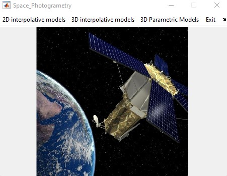
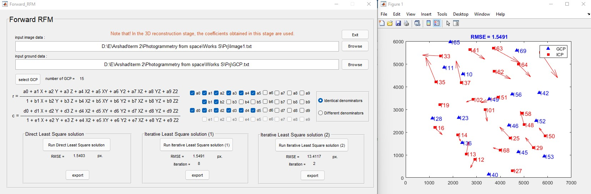

# Space-Photogrammetry-Equations

This software is produced for learning physical (Orbital Parameter Model) and interpolative equations in space photogrammetry.

Orbital Parameter Model: Safdarinezhad, A., & Zoej, M. J. V. (2015). An optimized orbital parameters model for geometric correction of space images. Advances in Space Research, 55(5), 1328-1338.‏

## Usage
To use the software, you must run Space_Photogrametry.m .

## Sample Results

